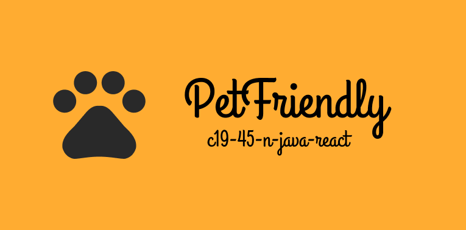

# 🐾 Equipo c19-45-n-java-react | No Country 🌎

## 📑 Descripción del Proyecto 🌈

PetFriendly es una plataforma creada con el objetivo de facilitar la adopción de mascotas y promover el bienestar animal.

### 💡¿Qué es PetFriendly?

Es un sistema integral y seguro que facilita la gestión y coordinación en torno a la adopción de mascotas. Nuestro MVP🏆 está orientado a proporcionar una solución efectiva para conectar a adoptantes con dueños de mascotas, brindando un proceso de adopción seguro y amigable. 🐶🐱

¡Únete a nosotros en esta noble causa y sé parte del cambio, da un hogar a una mascota! 🏡❤️

## 🌐 Deploy Frontend 🌟

💗 Página web PetFriendly 🌍 [Link a PetFriendly](https://github.com)

## 🎨 Diseño 🎨

🌈 Diseño en Figma 🖌️ [Link al Diseño Figma](https://www.figma.com/design/WTEMldZmA0Brt21RFhzOUx/PetFriendly---App?node-id=141-2&t=ex7eTm1vOTXDquUi-1)

## ✨ Equipo ✨

| Nombre             | Rol                | GitHub                                                                                                                       | LinkedIn                                                                                                                                   |
| ------------------ | ------------------ | ---------------------------------------------------------------------------------------------------------------------------- | ------------------------------------------------------------------------------------------------------------------------------------------ |
| Nataly Rojas       | PM / Frontend / UX |        |        |
| Carolina Rosillo   | QA Tester / UX     |                                                                                                                              |     |
| Edgar Camberos     | Backend       |      |      |
| Samir López     | Backend       |      |      |
| Robinson Zúñiga     | Backend       |      |      |
| Conrado González     | Frontend       |      |      |
| Jesus Garcia     | Frontend       |      |      |
| Jose Luis    | Frontend       |      |      |

## 🛠️ Tecnologías Utilizadas ⚡

**Frontend**

- Next.js
- TailwindCSS
- Daisyui

**Backend**

- Spring
- Swagger

**Organización**

- Slack
- Discord
- Trello
- Jira

## 🚀 Swagger: 🔥

🔸 Documentación de los endpoints en Swagger UI 🧾: [Link a Swagger UI](https://petfriendly-app-52da1108ba71.herokuapp.com/swagger-ui/index.html)
